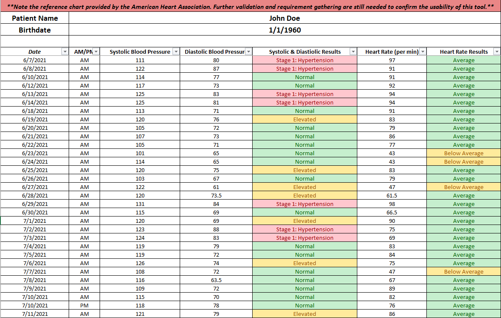
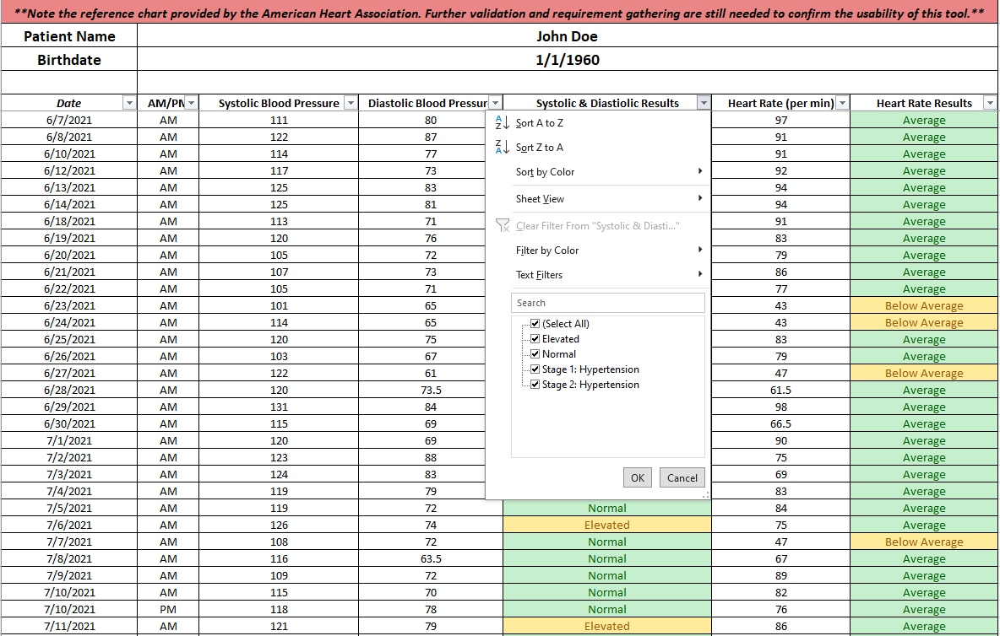
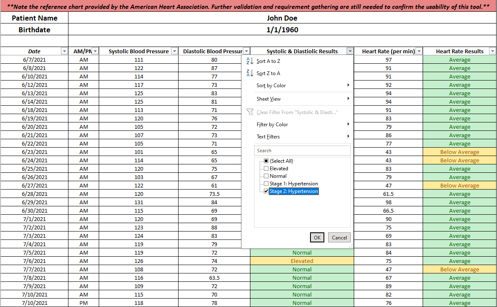
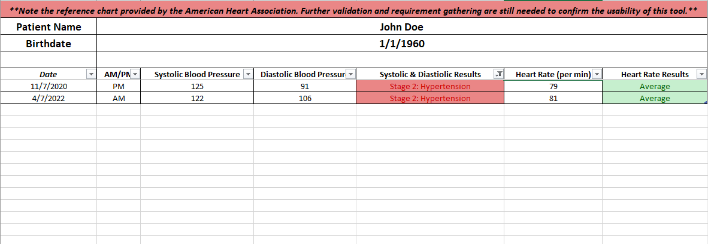

# Charting Blood Pressure to Support Physician Diagnosis using Excel

Here, we are creating a medical charting system that records a patient's blood pressure (BP) results and simultaniously analyzes the results overtime. This will allow physicians to easily track the patients BP results to see any changes in the patients condition.

With the patient's approval, we collected the data from a patient who undergone coronay artery bypass grafting and mitral valve repair in June 2020. He/She was advised to take, monitor, and record his/her blood pressure results after the surgery was performed. The dataset consists of the patient's blood pressure results from August 2020 to August 2022.

The patient wrote and recorded their results on a notebook. Then, data was manually transferred onto a [spreadsheet](https://github.com/christinepugay/bloodpressure/blob/main/bloodpressure_dataset.xlsx).

# Data Cleaning
Here are some data cleaning procedures that I performed to this dataset:
- I noticed that there were some days when the patient recorded their morning BP twice on the same day. To only keep one record, I took its average systolic, diastolic, heart rate and used this for the duplicated recordings.
- I deleted any missing date, when the patient forgets to take their BP.
- There were three records in the dataset where the patient did not write down the heart rate, I also got rid of these records.
  
# Charting the Data

## Overview of the BP Chart

## Filtering Demo
Using  the drop-down arrow on the column names, physicians can filter the data to only view certain records. 

Let's only view  records with Stage 2: Hypertension as a result

Click on the drop down arrow on the "Systolic & Diastolic Results" column

Unclick "Select All" box to unselect all the records, then click on "Stage 2: Hypertension". This will only return all patient's records with Stage 2: Hypertension as a result.  

Here are the results!

  

